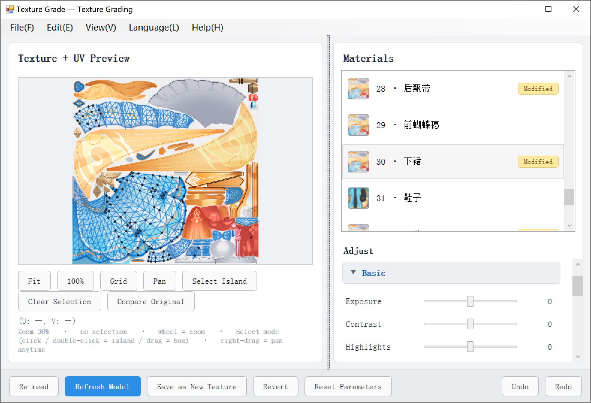

# TextureGrade — Texture Grading Plug-in for PMXEditor

A **texture grading plug-in** for PMXEditor, modeled on Lightroom / Camera Raw.
Grade model textures right inside the editor — exposure, color, HSL, curves and more — with
**live preview and a non-destructive workflow** (the original texture file is never modified).
Push the result to the 3D view when you like it, or save it as a new texture.

[English](ReadMe.md) | [简体中文](ReadMe_sc.md) | [繁體中文](ReadMe_tc.md) | [日本語](ReadMe_ja.md)



---

## 1. Features

### Grading (22 controls + per-channel HSL + Lab color wheel)

| Collapsible group | Parameters |
| --- | --- |
| Basic | Exposure / Contrast / Highlights / Shadows / Whites / Blacks |
| Color | Temperature / Tint / Vibrance / Saturation / Hue / Color Balance R·G·B |
| HSL (per channel) | Red · Orange · Yellow · Green · Aqua · Blue · Purple · Magenta × Hue / Saturation / Luminance (24 sliders) |
| Curves / Levels / RGB / HSV | Curve / Levels black point · white point · gamma / RGB·R·G·B / HSV·Value |
| Detail | Clarity / Sharpen |
| Effects | Gradient / Grayscale / Invert / Threshold |
| Lab color wheel | Iso-lightness hue ring (outer ring = hue, inner disc = chroma); lightness L* can be locked so only the color changes |

Fixed pipeline order: White balance → Exposure/Contrast → Highlights/Shadows → Whites/Blacks →
Levels → Saturation → Vibrance → HSL → Hue → Color Balance → HSV → Curves → RGB →
Clarity/Sharpen → Effects → Lab color wheel.

### Selection and UV

- The left panel is the **texture + UV preview**: the wheel zooms around the cursor, right-drag pans at any time.
- **Click** picks a single UV triangle (Shift = add, Ctrl = subtract).
- **Double-click** selects an entire **connected UV island** (like pressing `L` in Blender; connectivity is computed with a union-find).
- Left-drag = box-select (Select mode) or pan (Pan mode).
- **When a selection exists, grading only affects the selection** — everything outside keeps its original pixels.

### Non-destructive workflow

1. Moving a slider only changes the in-memory `WriteableBitmap` preview — **not a single byte of the original texture**.
2. **Refresh Model** writes the result to a temporary PNG and pushes it to PMXEditor's 3D view, so you can judge it in context.
3. **Save as New Texture** writes `xxx_new.png` to disk and points the material at it.
4. **Revert** restores `Material.Tex` to its original value and cleans up the temporary files.

### Also included

- **Material list**: texture thumbnail + index · name + "Modified" badge.
- **Per-material parameters**: each material remembers its own settings; switching back and forth loses nothing.
- **Presets**: save the current parameters as JSON, double-click to apply; stored in `presets\` next to the plug-in.
- **Histogram**: overlaid RGB, updated live; can be hidden from the View menu.
- **Compare Original**: toggle between the original texture and the graded result (parameters are kept).
- **Mask and UV layout export**: current selection mask / current material mask / all material masks (black & white PNG), plus a UV layout image (transparent background + wireframe PNG).
- **Multi-language**: English / 简体中文 / 繁體中文 / 日本語 — UI, status bar and message boxes are fully translated.
- **Help window**: reads the per-language manual from `data\` next to the plug-in; the window is freely resizable.

---

## 2. Project layout

```
PEPlugins-TextureGrade/
├─ MyPlugin.cs                 # Plug-in entry (PEPluginClass + PEPluginOption + Run)
├─ PluginForm.cs               # WinForms shell: menu strip (MenuStrip) + ElementHost
├─ Bridge/
│  ├─ IPMDBridge.cs            # Host abstraction (read PMX / push material / clean temp files)
│  └─ PmxBridge.cs             # PEPlugin API implementation
├─ Models/
│  ├─ ModelSnapshot.cs         # Material snapshot (name / texture path / diffuse / face count)
│  ├─ GradeSettings.cs         # Parameter table (indexer returns 0 for unset keys)
│  ├─ MiniJson.cs              # Dependency-free minimal JSON (preset read/write)
│  ├─ PresetStore.cs           # Preset storage (plug-in dir \presets, falls back to AppData)
│  └─ AppPaths.cs              # Resolves "the folder next to the DLL" + write probe
├─ ColorGrade/
│  ├─ ColorMath.cs             # Basic color math
│  ├─ IGradeEffect.cs / GradePipeline.cs
│  ├─ Effects_Basic.cs / Effects_Color.cs / Effects_Detail.cs
│  ├─ Effects_Fx.cs / Effects_HslBands.cs / Effects_LabColorize.cs
│  └─ LabColor.cs              # sRGB ↔ Lab(D65) ↔ LCh + MaxChroma bisection
├─ TextureIO/
│  ├─ TextureLoader.cs         # Texture loading and PNG saving
│  ├─ TgaReader.cs             # Hand-written TGA decoder
│  ├─ DdsReader.cs             # Hand-written DDS decoder (uncompressed / DXT1·3·5)
│  ├─ ThumbnailFactory.cs      # Material list thumbnails (downsampled at decode time)
│  ├─ TextureSize.cs           # Reads width/height from the file header only
│  ├─ MaskWriter.cs            # Black & white mask PNG
│  └─ TextureNaming.cs         # `xxx_new.png` / temporary preview naming
├─ WpfUI/
│  ├─ MainPanel.xaml(.cs)      # Main UI (left preview + right materials/adjustments)
│  ├─ LabWheel.cs              # Iso-lightness hue wheel control
│  └─ HelpWindow.cs            # Manual window (resizable, reads data\*.txt)
├─ Localization/
│  ├─ L.cs                     # Language enum + four-language string table + lang.txt
│  ├─ DefaultManual.cs         # Built-in default manual in four languages
│  └─ OperationManual.cs       # Creates and resolves the four manual files under data\
```

---

## 3. Building

### Requirements

- .NET Framework 4.8 target (`net48`)
- An SDK / MSBuild that can build `net48` (Visual Studio 2019+, or `dotnet build` with the .NET Framework 4.8 Targeting Pack installed)
- **Zero NuGet dependencies**: all texture decoding goes through GDI+ and the hand-written decoders in this repo, so no restore is needed

### Required DLLs

These come from your PMXEditor installation (the default `HintPath` points at `..\..\PmxEditor_0275\Lib\...`; edit `PEPlugins-TextureGrade.csproj` to match your machine):

```
PEPlugin.dll      → ..\..\PmxEditor_0275\Lib\PEPlugin\PEPlugin.dll
PmxEditorCore.dll → ..\..\PmxEditor_0275\Lib\System\PmxEditorCore.dll
PmxEditorLib.dll  → ..\..\PmxEditor_0275\Lib\System\PmxEditorLib.dll
PmxLib.dll        → ..\..\PmxEditor_0275\Lib\System\PmxLib.dll
SlimDX.dll        → ..\..\PmxEditor_0275\Lib\SlimDX\x86\SlimDX.dll
```

### Build

```bash
cd PEPlugins-TextureGrade
dotnet build -c Release
```

The output lands in `bin\Release\net48\`.

> Common warning: `MSB3270 … the processor architecture x86 of SlimDX does not match MSIL`.
> It is only a warning — PMXEditor is a 32-bit process and the plug-in is loaded as AnyCPU,
> so the host decides the bitness at run time. To silence it, add `<Private>true</Private>` to
> the SlimDX reference in the csproj, or set the project platform to x86.

---

## 4. Installation

1. Build `PEPlugins-TextureGrade.dll`.
2. Copy it into the PMXEditor\_plugin folder.
3. Start PMXEditor and open a model.
4. Click **Texture Grade** in the plug-in / context menu to open the window.

> Put the DLL in a **writable folder** (not under `Program Files`).
> The plug-in writes `presets\`, `data\` and `lang.txt` next to the DLL;
> if that folder is not writable it falls back to `%APPDATA%\TextureGrade\`,
> but then presets and manuals you placed by hand may not be found.

### Files created on first run

```
<plug-in folder>\
├─ lang.txt                                # Language choice
├─ presets\*.json                          # Grading presets
└─ data\
   ├─ TextureGrade_Operation_EN.txt        # English
   ├─ TextureGrade_Operation_SC.txt        # 简体中文
   ├─ TextureGrade_Operation_TC.txt        # 繁體中文
   └─ TextureGrade_Operation_JP.txt        # 日本語
```

Only missing files are generated; **existing ones are never overwritten**.
Edit them freely, then click **Reload** in the manual window.

---

## 5. Usage

1. Pick a material in the **material list** on the right → the left panel loads its texture and UVs.
2. For local edits, click / double-click / box-select UV faces in the left panel (with no selection, grading applies to the whole texture).
3. Expand a group on the right and drag sliders; the preview and histogram update live.
4. Use **Compare Original** to check the difference; parameters can be undone / redone / reset.
5. **Refresh Model** to see it in 3D; when you are happy, **Save as New Texture** writes `xxx_new.png`.

### Supported texture formats

| Format | Support |
| --- | --- |
| PNG / JPG / BMP / GIF / TIFF | Native GDI+ decoding |
| TGA | Hand-written decoder (RLE / non-RLE, 16/24/32-bit) |
| DDS | Hand-written decoder (uncompressed + DXT1 / DXT3 / DXT5) |

---

## 6. Languages

- Menu **Language** → English / 简体中文 / 繁體中文 / 日本語.
- The choice is written to `lang.txt` next to the plug-in and reused on the next launch; on first launch it is guessed from the system UI language.
- The main panel uses **registered re-fetch** (`MainPanel.ApplyLanguage()`): switching languages does **not** rebuild the panel, so expanded groups, scroll position, the current material and all parameters are preserved. The menu strip is rebuilt wholesale.
- After a language switch, the manual window re-reads the matching file under `data\`; if it is open, it refreshes immediately.
- **Button captions on message boxes and file dialogs (OK / Yes / No) come from Windows and follow the OS language** — they cannot be localized from inside the app. Titles and body text are fully translated.

### Adding new strings

All UI text goes through `Localization/L.cs` using `L.T(key)` / `L.F(key, args)`.
When you add a key, **add all four languages at once**; missing entries fall back to English.

---

## 7. Known limitations / troubleshooting

| Symptom | Note |
| --- | --- |
| The plug-in does not appear in the menu | Check the DLL location relative to `PEPlugin.dll`, and the registered menu name `Texture Grade`. |
| Material path changed but the 3D view does not update | On some PMXEditor versions `UpdateObject.Material` does not force a redraw; try `UpdateObject.All` in `PmxBridge`. |
| Some DDS files fail to open | Only uncompressed and DXT1·3·5 are supported; convert other formats to PNG first. |
| Connected islands come out too fragmented / too large | Connectivity is based on shared edges after quantizing UVs to `1e-4`; seams split islands. |
| Huge textures feel sluggish | Grading and the histogram are computed in a single pass; above 4096² the delay is noticeable. Thumbnails are downsampled at decode time and are unaffected. |

---

## 8. License / Notes

Licensed under [GPL-3.0](https://www.gnu.org/licenses/gpl-3.0.html).

Referenced plug-ins:
- どるる式UVエディタ
- https://bowlroll.net/file/15244
