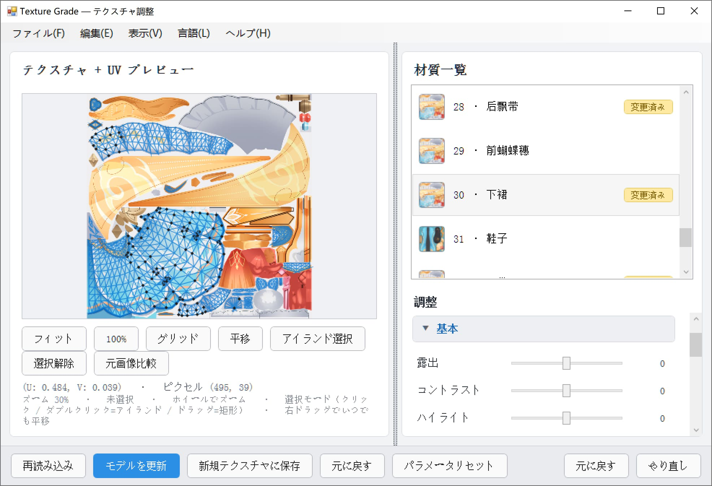

# TextureGrade — PMXEditor 用テクスチャ調色プラグイン

PMXEditor **テクスチャ調色プラグイン**です。Lightroom / Camera Raw の調色機能を模しています。
プラグイン内でモデルのテクスチャに露出・カラー・HSL・カーブなどの調整をまとめて適用でき、
**リアルタイムプレビュー & 非破壊**（元テクスチャは書き換えません）。
仕上がりを確認してから 3D ビューへ反映、または新規テクスチャとして保存します。

[English](ReadMe.md) | [简体中文](ReadMe_sc.md) | [繁體中文](ReadMe_tc.md) | [日本語](ReadMe_ja.md)



---

## 一、機能

### 調色（22 項目 + HSL チャンネル別 + Lab カラーホイール）

| 折りたたみグループ | パラメーター |
| --- | --- |
| 基本 | 露出 / コントラスト / ハイライト / シャドウ / 白レベル / 黒レベル |
| カラー | 色温度 / 色かぶり補正 / 自然な彩度 / 彩度 / 色相 / カラーバランス R·G·B |
| HSL（チャンネル別） | 赤·橙·黄·緑·水·青·紫·マゼンタ × 色相 / 彩度 / 明度（全 24 スライダー） |
| カーブ / レベル / RGB / HSV | カーブ / レベル黒点·白点·ガンマ / RGB·R·G·B / HSV·明度 |
| ディテール | 明瞭度 / シャープ |
| エフェクト | グラデーション / 白黒 / 反転 / 2 値化 |
| Lab カラーホイール | 等明度色相環（外環 = 色相、内円 = 彩度）。明度 L* をロックして色だけ変更可能 |

パイプラインの順序は固定です：ホワイトバランス → 露出/コントラスト → ハイライト/シャドウ →
白黒レベル → レベル補正 → 彩度 → 自然な彩度 → HSL → 色相 → カラーバランス → HSV →
カーブ → RGB → 明瞭度/シャープ → エフェクト → Lab カラーホイール。

### 選択範囲と UV

- 左パネルは「テクスチャ + UV プレビュー」：ホイールでカーソル中心にズーム、右ドラッグでいつでも平移。
- **クリック** で UV 三角面を 1 枚選択（Shift で追加 / Ctrl で削除）。
- **ダブルクリック** で**連結した UV アイランド**をまとめて選択（Blender の `L` キー相当。連結判定は Union-Find で計算）。
- 左ドラッグ = 矩形選択（選択モード）または平移（平移モード）。
- **選択範囲がある場合、調色は選択範囲のみ**に適用され、それ以外は元のピクセルのままです。

### 非破壊ワークフロー

1. スライダーはメモリ上の `WriteableBitmap` プレビューを変更するだけで、**元テクスチャは 1 バイトも書き換えません**。
2. 「モデルを更新」で結果を一時 PNG に書き出し、PMXEditor の 3D ビューへ反映してリアルタイムに確認できます。
3. 「新規テクスチャに保存」で `xxx_new.png` として書き出し、材質の参照先を変更します。
4. 「元に戻す」で `Material.Tex` を元の値に復元し、一時ファイルを削除します。

### その他の機能

- **材質一覧**：サムネイル + 番号·名称 + 「変更済み」バッジ。
- **材質ごとのパラメーター**：材質別に記憶されるため、切り替えても失われません。
- **プリセット**：調整値を JSON で保存し、ダブルクリックで適用。プラグイン配下の `presets\` に格納。
- **ヒストグラム**：RGB 重ね合わせ、リアルタイム更新（表示メニューで非表示可）。
- **元画像比較**：元テクスチャと調整結果をワンクリックで切り替え（パラメーターは保持）。
- **マスク・UV レイアウト書き出し**：選択範囲マスク / 現在の材質マスク / 全材質マスク（白黒 PNG）、
  UV レイアウト図（透明背景 + ワイヤーフレーム PNG）。
- **多言語**：English / 简体中文 / 繁體中文 / 日本語。UI・ステータスバー・メッセージボックスを完全翻訳。
- **ヘルプウィンドウ**：プラグイン配下 `data\` の言語別マニュアルを読み込みます。ウィンドウは自由にリサイズ可能。

---

## 二、ディレクトリ構成

```
PEPlugins-TextureGrade/
├─ MyPlugin.cs                 # プラグイン入口（PEPluginClass + PEPluginOption + Run）
├─ PluginForm.cs               # WinForms シェル：メニューバー（MenuStrip）+ ElementHost
├─ Bridge/
│  ├─ IPMDBridge.cs            # ホスト機能の抽象化（PMX 取得 / 材質反映 / 一時ファイル削除）
│  └─ PmxBridge.cs             # PEPlugin API の実装
├─ Models/
│  ├─ ModelSnapshot.cs         # 材質スナップショット（名称/テクスチャパス/拡散色/面数）
│  ├─ GradeSettings.cs         # パラメーター表（未設定キーは 0 を返すインデクサー）
│  ├─ MiniJson.cs              # 依存ゼロの極簡 JSON（プリセット読み書き）
│  ├─ PresetStore.cs           # プリセット保存（プラグイン配下 presets\、不可書時は AppData）
│  └─ AppPaths.cs              # 「DLL と同じフォルダ」の解決 + 書き込み可否判定
├─ ColorGrade/
│  ├─ ColorMath.cs             # 基本的な色演算
│  ├─ IGradeEffect.cs / GradePipeline.cs
│  ├─ Effects_Basic.cs / Effects_Color.cs / Effects_Detail.cs
│  ├─ Effects_Fx.cs / Effects_HslBands.cs / Effects_LabColorize.cs
│  └─ LabColor.cs              # sRGB ↔ Lab(D65) ↔ LCh + MaxChroma 二分探索
├─ TextureIO/
│  ├─ TextureLoader.cs         # テクスチャ読み込みと PNG 保存
│  ├─ TgaReader.cs             # 自作 TGA デコーダー
│  ├─ DdsReader.cs             # 自作 DDS デコーダー（無圧縮 / DXT1·3·5）
│  ├─ ThumbnailFactory.cs      # 材質一覧のサムネイル（デコード時に間引き）
│  ├─ TextureSize.cs           # ヘッダのみ読み取ってサイズ取得
│  ├─ MaskWriter.cs            # 白黒マスク PNG
│  └─ TextureNaming.cs         # `xxx_new.png` / 一時プレビューの命名
├─ WpfUI/
│  ├─ MainPanel.xaml(.cs)      # メイン画面（左プレビュー + 右 材質/調整）
│  ├─ LabWheel.cs              # 等明度色相環コントロール
│  └─ HelpWindow.cs            # 操作説明ウィンドウ（リサイズ可、data\*.txt を読む）
├─ Localization/
│  ├─ L.cs                     # 言語 enum + 4 言語テーブル + lang.txt 読み書き
│  ├─ DefaultManual.cs         # 4 言語の内蔵マニュアル
│  └─ OperationManual.cs       # data\ 配下 4 ファイルの生成と解決
```

---

## 三、ビルド方法

### 環境

- ターゲットフレームワーク .NET Framework 4.8（`net48`）
- `net48` をビルドできる SDK / MSBuild（Visual Studio 2019 以降、または .NET Framework 4.8 Targeting Pack を入れた `dotnet build`）
- **NuGet 依存ゼロ**：テクスチャのデコードは GDI+ と同梱の自作デコーダーのみ。restore は不要です

### 依存 DLL

PMXEditor インストール先から以下の DLL が必要です（既定の HintPath は `..\..\PmxEditor_0275\Lib\...`。
実際のパスに合わせて `PEPlugins-TextureGrade.csproj` を編集してください）：

```
PEPlugin.dll      → ..\..\PmxEditor_0275\Lib\PEPlugin\PEPlugin.dll
PmxEditorCore.dll → ..\..\PmxEditor_0275\Lib\System\PmxEditorCore.dll
PmxEditorLib.dll  → ..\..\PmxEditor_0275\Lib\System\PmxEditorLib.dll
PmxLib.dll        → ..\..\PmxEditor_0275\Lib\System\PmxLib.dll
SlimDX.dll        → ..\..\PmxEditor_0275\Lib\SlimDX\x86\SlimDX.dll
```

### ビルド

```bash
cd PEPlugins-TextureGrade
dotnet build -c Release
```

出力は `bin\Release\net48\` に生成されます。

> よく出る警告：`MSB3270 … SlimDX のプロセッサ アーキテクチャ x86 が MSIL と一致しない`。
> 警告のみで問題ありません。PMXEditor は 32 ビットプロセスで、プラグインは AnyCPU として読み込まれ、
> 実行時のビット数はホストが決めます。消したい場合は csproj の SlimDX 参照に
> `<Private>true</Private>` を追加するか、プロジェクトのプラットフォームを x86 にしてください。

---

## 四、インストール方法

1. `PEPlugins-TextureGrade.dll` をビルドします。
2. PMXEditor\_plugin のプラグインフォルダにコピーします。
3. PMXEditor を起動し、モデルを開きます。
4. プラグイン / 右クリックメニューから **Texture Grade** を選んでウィンドウを開きます。

> **書き込み可能なフォルダ**に置いてください（`Program Files` 配下は避ける）。
> プラグインは DLL と同じ階層に `presets\`、`data\`、`lang.txt` を書き込みます。
> 書き込めない場合は `%APPDATA%\TextureGrade\` にフォールバックしますが、
> 手動で置いたプリセットやマニュアルが読めなくなる可能性があります。

### 初回起動時に自動生成されるファイル

```
<プラグインフォルダ>\
├─ lang.txt                                # 言語設定
├─ presets\*.json                          # 調色プリセット
└─ data\
   ├─ TextureGrade_Operation_EN.txt        # English
   ├─ TextureGrade_Operation_SC.txt        # 简体中文
   ├─ TextureGrade_Operation_TC.txt        # 繁體中文
   └─ TextureGrade_Operation_JP.txt        # 日本語
```

4 ファイルのうち不足分だけを生成し、**既存ファイルは上書きしません**。
内容をカスタマイズしたい場合は該当 txt を直接編集し、説明ウィンドウの「再読み込み」を押してください。

---

## 五、使い方

1. 右側の**材質一覧**で材質を選ぶ → 左パネルにテクスチャと UV が読み込まれます。
2. 部分的に調整したい場合は、左パネルでクリック / ダブルクリック / 矩形選択（未選択なら全体に適用）。
3. 右側のグループを展開してスライダーを動かすと、プレビューとヒストグラムがリアルタイムに更新されます。
4. 「元画像比較」で変更前後を確認。パラメーターは取り消し / やり直し / リセットできます。
5. 「モデルを更新」で 3D 表示を確認し、納得したら「新規テクスチャに保存」で `xxx_new.png` を書き出します。

### 対応テクスチャ形式

| 形式 | 対応状況 |
| --- | --- |
| PNG / JPG / BMP / GIF / TIFF | GDI+ 標準デコード |
| TGA | 同梱の自作デコーダー（RLE / 非 RLE、16/24/32 ビット） |
| DDS | 同梱の自作デコーダー（無圧縮 + DXT1 / DXT3 / DXT5） |

---

## 六、多言語

- メニューバー **言語** → English / 简体中文 / 繁體中文 / 日本語。
- 選択内容はプラグインフォルダの `lang.txt` に保存され、次回起動時に引き継がれます。初回起動時はシステムの UI 言語から推測します。
- メイン画面は「登録型の再取得」（`MainPanel.ApplyLanguage()`）を採用しており、言語切り替えで**パネルを再構築しません**。
  折りたたみ状態・スクロール位置・現在の材質・調整済みパラメーターはすべて保持されます。メニューバーは丸ごと再構築します。
- 言語を切り替えると説明ウィンドウは `data\` 配下の該当ファイルを読み直します。開いている場合は即座に更新されます。
- メッセージボックスやファイルダイアログの**ボタン文字（OK / はい / いいえ）は Windows の表示言語に従います**。
  これらは OS が描画するため、アプリ側からは変更できません。タイトルと本文はすべて翻訳済みです。

### 文言の追加

UI の文言はすべて `Localization/L.cs` の `L.T(key)` / `L.F(key, args)` を通します。
キーを追加する際は** 4 言語すべてを同時に追加**してください。未登録の場合は英語にフォールバックします。

---

## 七、既知の制限 / トラブルシューティング

| 症状 | 説明 |
| --- | --- |
| プラグイン一覧に項目が出ない | DLL と `PEPlugin.dll` の配置関係、および登録メニュー名 `Texture Grade` を確認してください。 |
| テクスチャを差し替えても 3D ビューが更新されない | PMXEditor のバージョンによっては `UpdateObject.Material` で再描画されません。`PmxBridge` で `UpdateObject.All` を試してください。 |
| 一部の DDS が開けない | 無圧縮と DXT1·3·5 のみ対応です。その他の圧縮形式は PNG に変換してください。 |
| 連結アイランドの選択が細かすぎる / 大きすぎる | UV 座標を `1e-4` で量子化して辺の共有を判定しています。UV に継ぎ目があると複数ブロックに分かれます。 |
| 巨大テクスチャが重い | 調色とヒストグラムは 1 回の走査で計算しているため、4096² を超えると遅延を感じます。サムネイルはデコード時に間引くため影響ありません。 |

---

## 八、License / 備考

ライセンスは [GPL-3.0](https://www.gnu.org/licenses/gpl-3.0.ja.html) です。

以下のプラグインを参考にしました：
- どるる式UVエディタ
- https://bowlroll.net/file/15244
