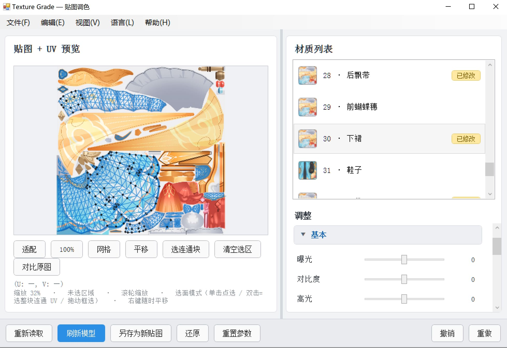

# TextureGrade — PMXEditor 贴图调色插件

PMXEditor **贴图调色插件**，仿 Lightroom / Camera Raw 调色功能。
在插件里直接给模型贴图做曝光、色彩、HSL、曲线等一整套调色，**实时预览、非破坏式**（不改动原始贴图文件），满意后再推送到 3D 视图或另存为新贴图。

[English](ReadMe.md) | [简体中文](ReadMe_sc.md) | [繁體中文](ReadMe_tc.md) | [日本語](ReadMe_ja.md)



---

## 一、功能特点

### 调色（22 项 + HSL 分通道 + Lab 取色环）

| 折叠组 | 参数 |
| --- | --- |
| 基本 | 曝光 / 对比度 / 高光 / 阴影 / 白色 / 黑色 |
| 色彩 | 色温 / 色调 / 自然饱和度 / 饱和度 / 色相 / 色彩平衡 R·G·B |
| HSL 分通道 | 红·橙·黄·绿·青·蓝·紫·品红 × 色相 / 饱和度 / 明度（共 24 个滑块） |
| 曲线 / 色阶 / RGB / HSV | 曲线 / 色阶黑点·白点·灰阶 / RGB·R·G·B / HSV·明度 |
| 细节 | 清晰度 / 锐化 |
| 效果 | 渐变 / 黑白 / 反相 / 阈值 |
| Lab 取色环 | 等亮度色相环（外环色相 + 内圈彩度），可锁定亮度 L* 只换颜色不改明暗 |

管线固定顺序：白平衡 → 曝光/对比 → 高光阴影 → 白黑 → 色阶 → 饱和 → 自然饱和 →
HSL 分通道 → 色相 → 色彩平衡 → HSV → 曲线 → RGB → 清晰/锐化 → 效果 → Lab 取色环。

### 选区与 UV

- 左栏是「贴图 + UV 预览」：滚轮以光标为中心缩放，右键随时平移。
- **单击** 点选单个 UV 三角面（Shift 加选 / Ctrl 减选）。
- **双击** 一次选中整块**连通 UV 岛**（类 Blender 按 `L` 的手感，内部用并查集算连通块）。
- 左键拖动 = 框选（选面模式）或平移（平移模式）。
- **有选区时调色只作用于选区**，选区外像素保持原样。

### 非破坏式工作流

1. 拖动滑块只改内存里的 `WriteableBitmap` 预览，**原贴图文件一个字节都不动**。
2. 「刷新模型」把结果写成临时 PNG 推给 PMXEditor 的 3D 视图，用于实时看效果。
3. 「另存为新贴图」落盘成 `xxx_new.png` 并让材质指向它。
4. 「还原」把 `Material.Tex` 恢复原始值并清理临时文件。

### 其它

- **材质列表**：贴图缩略图 + 序号·名称 +「已修改」徽章。
- **分材质参数**：每个材质的调色参数分别记忆，来回切材质不丢。
- **预设**：调好的参数存成 JSON，双击即套用；预设放在插件目录 `presets\`。
- **直方图**：RGB 叠加，实时反映预览，视图菜单可关。
- **对比原图**：一键切换原图 / 调色结果（参数保留）。
- **蒙版与 UV 布局导出**：当前选区蒙版 / 当前材质蒙版 / 全部材质蒙版（黑白 PNG）、UV 布局图（透明底 + 线框 PNG）。
- **多语言**：English / 简体中文 / 繁體中文 / 日本語，界面、状态栏、消息框全覆盖。
- **帮助窗口**：固定入口读取插件目录 `data\` 下按语言分文件的操作说明 txt，可自由缩放。

---

## 二、目录结构

```
PEPlugins-TextureGrade/
├─ MyPlugin.cs                 # 插件入口（PEPluginClass + PEPluginOption + Run）
├─ PluginForm.cs               # WinForms 外壳：菜单栏（MenuStrip）+ ElementHost
├─ Bridge/
│  ├─ IPMDBridge.cs            # 宿主能力抽象（读 PMX / 推送材质 / 清理临时文件）
│  └─ PmxBridge.cs             # PEPlugin API 实现
├─ Models/
│  ├─ ModelSnapshot.cs         # 材质快照（名称/贴图路径/漫反射/面数）
│  ├─ GradeSettings.cs         # 参数表（索引器，未设置的键返回 0）
│  ├─ MiniJson.cs              # 零依赖极简 JSON（预设读写）
│  ├─ PresetStore.cs           # 预设存取（插件目录 presets\，不可写回退 AppData）
│  └─ AppPaths.cs              # 「插件同级目录」定位 + 可写性探针
├─ ColorGrade/
│  ├─ ColorMath.cs             # 基础色彩运算
│  ├─ IGradeEffect.cs / GradePipeline.cs
│  ├─ Effects_Basic.cs / Effects_Color.cs / Effects_Detail.cs
│  ├─ Effects_Fx.cs / Effects_HslBands.cs / Effects_LabColorize.cs
│  └─ LabColor.cs              # sRGB ↔ Lab(D65) ↔ LCh + MaxChroma 二分
├─ TextureIO/
│  ├─ TextureLoader.cs         # 贴图加载与 PNG 保存
│  ├─ TgaReader.cs             # 手写 TGA 解码器
│  ├─ DdsReader.cs             # 手写 DDS 解码器（未压缩 / DXT1·3·5）
│  ├─ ThumbnailFactory.cs      # 材质列表缩略图（解码期降采样）
│  ├─ TextureSize.cs           # 只读文件头取宽高
│  ├─ MaskWriter.cs            # 黑白蒙版 PNG
│  └─ TextureNaming.cs         # `xxx_new.png` / 临时预览文件命名
├─ WpfUI/
│  ├─ MainPanel.xaml(.cs)      # 主界面（左预览 + 右材质/调整）
│  ├─ LabWheel.cs              # 等亮度色相环控件
│  └─ HelpWindow.cs            # 操作说明窗口（可缩放，读 data\*.txt）
├─ Localization/
│  ├─ L.cs                     # 语言枚举 + 四语词条表 + lang.txt 存取
│  ├─ DefaultManual.cs         # 四语内置默认说明
│  └─ OperationManual.cs       # data\ 下四份说明文件的生成与解析
```

---

## 三、编译方式

### 环境

- .NET Framework 4.8 目标框架（`net48`）
- 能编 `net48` 的 SDK / MSBuild（Visual Studio 2019+ 或 `dotnet build`，需装 .NET Framework 4.8 Targeting Pack）
- **零 NuGet 依赖**：贴图解码全部走 GDI+ 与项目内手写解码器，不需要 restore

### 依赖 DLL

需要 PMXEditor 安装目录里的这几个（默认 HintPath 指向 `..\..\PmxEditor_0275\Lib\...`，按你的实际路径改 `PEPlugins-TextureGrade.csproj`）：

```
PEPlugin.dll      → ..\..\PmxEditor_0275\Lib\PEPlugin\PEPlugin.dll
PmxEditorCore.dll → ..\..\PmxEditor_0275\Lib\System\PmxEditorCore.dll
PmxEditorLib.dll  → ..\..\PmxEditor_0275\Lib\System\PmxEditorLib.dll
PmxLib.dll        → ..\..\PmxEditor_0275\Lib\System\PmxLib.dll
SlimDX.dll        → ..\..\PmxEditor_0275\Lib\SlimDX\x86\SlimDX.dll
```

### 构建

```bash
cd PEPlugins-TextureGrade
dotnet build -c Release
```

产物在 `bin\Release\net48\`。

> 常见警告：`MSB3270 … SlimDX 的处理器架构 x86 与 MSIL 不匹配` —— 只是警告，
> PMXEditor 是 32 位进程、插件以 AnyCPU 加载，运行时由宿主决定位数，可忽略。
> 若想消除，可在 csproj 里给 SlimDX 引用加 `<Private>true</Private>` 或把项目目标平台设为 x86。

---

## 四、安装方法

1. 编译得到 `PEPlugins-TextureGrade.dll`。
2. 把它复制到 PMXEditor\_plugin 的插件目录。
3. 启动 PMXEditor，打开一个模型。
4. 在插件 / 右键菜单里点 **Texture Grade** 打开窗口。

> 建议把 DLL 放在**可写目录**（不要放 `Program Files` 下）。
> 插件需要在 DLL 同级目录写 `presets\`、`data\`、`lang.txt`；
> 目录不可写时会自动回退到 `%APPDATA%\TextureGrade\`，但仍可能读不到你手放的预设/说明。

### 随插件一起会出现的文件（首次运行自动生成）

```
<插件目录>\
├─ lang.txt                                # 语言选择
├─ presets\*.json                          # 调色预设
└─ data\
   ├─ TextureGrade_Operation_EN.txt        # English
   ├─ TextureGrade_Operation_SC.txt        # 简体中文
   ├─ TextureGrade_Operation_TC.txt        # 繁體中文
   └─ TextureGrade_Operation_JP.txt        # 日本語
```

四份说明缺哪份就自动补哪份，**已存在的文件不会被覆盖**。
想自定义说明直接改对应 txt，然后在帮助窗口点「重新载入」。

---

## 五、使用方法

1. 右侧**材质列表**点一个材质 → 左栏加载它的贴图与 UV。
2. 需要局部调整时，在左栏单击 / 双击 / 框选 UV 面（不选则作用于整张贴图）。
3. 右侧展开折叠组拖滑块调色，左栏与直方图实时更新。
4. 「对比原图」看前后差异；参数可撤销 / 重做 / 重置。
5. 「刷新模型」看 3D 效果；满意后「另存为新贴图」落盘（生成 `xxx_new.png`）。

### 支持的贴图格式

| 格式 | 支持情况 |
| --- | --- |
| PNG / JPG / BMP / GIF / TIFF | GDI+ 原生解码 |
| TGA | 项目内手写解码器（RLE / 非 RLE，16/24/32 位） |
| DDS | 项目内手写解码器（未压缩 + DXT1 / DXT3 / DXT5） |

---

## 六、多语言

- 菜单栏 **语言** → English / 简体中文 / 繁體中文 / 日本語。
- 选择写进插件目录的 `lang.txt`，下次启动自动沿用；首次启动按系统 UI 语言猜测。
- 主界面走「登记式重取词」（`MainPanel.ApplyLanguage()`），切换语言**不重建面板**，
  折叠状态、滚动位置、当前材质、已调参数全部保留；菜单栏整体重建。
- 帮助窗口切换语言后会改读 `data\` 下对应后缀的说明文件；窗口开着时即时刷新。
- MessageBox / 打开保存对话框上的**按钮文字（OK / 是 / 否）由 Windows 系统语言决定**，
  这是系统绘制的，应用内改不了；标题与正文已全部翻译。

### 新增文案

所有界面文案都走 `Localization/L.cs` 的 `L.T(key)` / `L.F(key, args)`。
新增词条时**四种语言必须同时加**，缺失会自动回退英文。

---

## 七、已知限制 / 排错

| 现象 | 说明 |
| --- | --- |
| 插件列表里看不到菜单 | 确认 DLL 与 `PEPlugin.dll` 的位置关系，以及菜单注册名 `Texture Grade`。 |
| 改了贴图路径但 3D 视图不刷新 | 个别 PMXEditor 版本下 `UpdateObject.Material` 不触发重绘，可在 `PmxBridge` 里改试 `UpdateObject.All`。 |
| 某些 DDS 打不开 | 仅支持未压缩 / DXT1·3·5，其他压缩格式请先用工具转 PNG。 |
| 连通块选得太碎/太大 | 判定阈值是 UV 坐标按 `1e-4` 量化后看是否共享边，模型 UV 有缝时会分成多块。 |
| 巨大贴图卡顿 | 调色与直方图在一次遍历里算，4096² 以上会有可感知延迟；缩略图走解码期降采样不受影响。 |

---

## 八、License / 备注

许可证采用 [GPL-3.0](https://www.gnu.org/licenses/gpl-3.0.zh-cn.html)

参考了以下插件：
- どるる式UVエディタ
- https://bowlroll.net/file/15244

