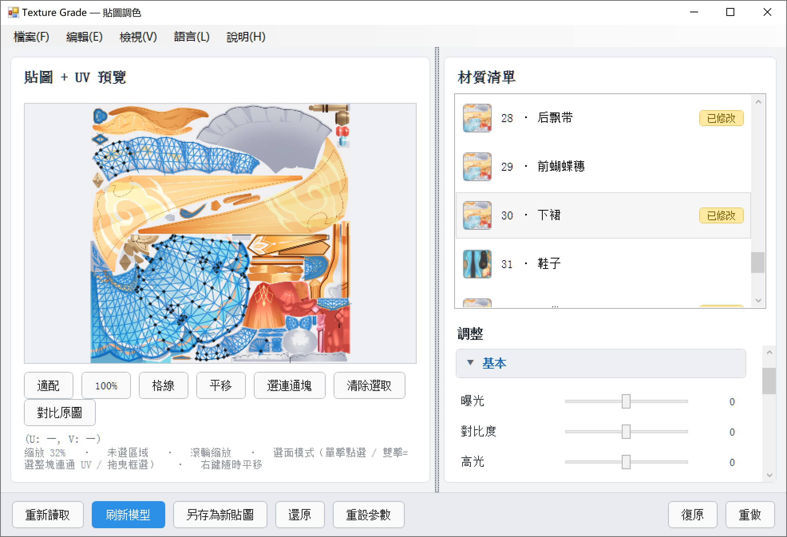

# TextureGrade — PMXEditor 貼圖調色外掛

PMXEditor **貼圖調色外掛**，仿 Lightroom / Camera Raw 調色功能。
在外掛裡直接為模型貼圖做曝光、色彩、HSL、曲線等一整套調色，**即時預覽、非破壞式**
（不更動原始貼圖檔案），滿意後再推送到 3D 視圖或另存為新貼圖。

[English](ReadMe.md) | [简体中文](ReadMe_sc.md) | [繁體中文](ReadMe_tc.md) | [日本語](ReadMe_ja.md)



---

## 一、功能特點

### 調色（22 項 + HSL 分通道 + Lab 取色環）

| 摺疊組 | 參數 |
| --- | --- |
| 基本 | 曝光 / 對比度 / 高光 / 陰影 / 白色 / 黑色 |
| 色彩 | 色溫 / 色調 / 自然飽和度 / 飽和度 / 色相 / 色彩平衡 R·G·B |
| HSL 分通道 | 紅·橙·黃·綠·青·藍·紫·洋紅 × 色相 / 飽和度 / 明度（共 24 個滑桿） |
| 曲線 / 色階 / RGB / HSV | 曲線 / 色階黑點·白點·灰階 / RGB·R·G·B / HSV·明度 |
| 細節 | 清晰度 / 銳化 |
| 效果 | 漸層 / 黑白 / 反相 / 臨界值 |
| Lab 取色環 | 等亮度色相環（外環色相 + 內圈彩度），可鎖定亮度 L* 只換顏色不改明暗 |

管線固定順序：白平衡 → 曝光/對比 → 高光陰影 → 白黑 → 色階 → 飽和 → 自然飽和 →
HSL 分通道 → 色相 → 色彩平衡 → HSV → 曲線 → RGB → 清晰/銳化 → 效果 → Lab 取色環。

### 選取與 UV

- 左欄是「貼圖 + UV 預覽」：滾輪以游標為中心縮放，右鍵隨時平移。
- **單擊** 點選單一 UV 三角面（Shift 加選 / Ctrl 減選）。
- **雙擊** 一次選取整塊**連通 UV 島**（類 Blender 按 `L` 的手感，內部以併查集計算連通塊）。
- 左鍵拖曳 = 框選（選面模式）或平移（平移模式）。
- **有選取範圍時調色只作用於選取範圍**，選取外像素維持原樣。

### 非破壞式工作流程

1. 拖動滑桿只改記憶體裡的 `WriteableBitmap` 預覽，**原始貼圖檔案一個位元組都不動**。
2. 「刷新模型」把結果寫成暫存 PNG 推給 PMXEditor 的 3D 視圖，用來即時看效果。
3. 「另存為新貼圖」落碟成 `xxx_new.png` 並讓材質指向它。
4. 「還原」把 `Material.Tex` 恢復原始值並清理暫存檔。

### 其它

- **材質清單**：貼圖縮圖 + 序號·名稱 +「已修改」徽章。
- **分材質參數**：每個材質的調色參數分別記憶，來回切材質不會遺失。
- **預設**：調好的參數存成 JSON，雙擊即套用；預設放在外掛目錄 `presets\`。
- **直方圖**：RGB 疊加，即時反映預覽，檢視選單可關閉。
- **對比原圖**：一鍵切換原圖 / 調色結果（參數保留）。
- **遮罩與 UV 佈局匯出**：目前選取遮罩 / 目前材質遮罩 / 全部材質遮罩（黑白 PNG）、UV 佈局圖（透明底 + 線框 PNG）。
- **多語言**：English / 简体中文 / 繁體中文 / 日本語，介面、狀態列、訊息方塊完整翻譯。
- **說明視窗**：讀取外掛目錄 `data\` 下依語言分檔的操作說明 txt，可自由縮放。

---

## 二、目錄結構

```
PEPlugins-TextureGrade/
├─ MyPlugin.cs                 # 外掛入口（PEPluginClass + PEPluginOption + Run）
├─ PluginForm.cs               # WinForms 外殼：功能表列（MenuStrip）+ ElementHost
├─ Bridge/
│  ├─ IPMDBridge.cs            # 宿主能力抽象（讀 PMX / 推送材質 / 清理暫存檔）
│  └─ PmxBridge.cs             # PEPlugin API 實作
├─ Models/
│  ├─ ModelSnapshot.cs         # 材質快照（名稱/貼圖路徑/漫射/面數）
│  ├─ GradeSettings.cs         # 參數表（索引子，未設定的鍵回傳 0）
│  ├─ MiniJson.cs              # 零依賴極簡 JSON（預設讀寫）
│  ├─ PresetStore.cs           # 預設存取（外掛目錄 presets\，不可寫回退 AppData）
│  └─ AppPaths.cs              # 「外掛同級目錄」定位 + 可寫性探針
├─ ColorGrade/
│  ├─ ColorMath.cs             # 基礎色彩運算
│  ├─ IGradeEffect.cs / GradePipeline.cs
│  ├─ Effects_Basic.cs / Effects_Color.cs / Effects_Detail.cs
│  ├─ Effects_Fx.cs / Effects_HslBands.cs / Effects_LabColorize.cs
│  └─ LabColor.cs              # sRGB ↔ Lab(D65) ↔ LCh + MaxChroma 二分
├─ TextureIO/
│  ├─ TextureLoader.cs         # 貼圖載入與 PNG 儲存
│  ├─ TgaReader.cs             # 手寫 TGA 解碼器
│  ├─ DdsReader.cs             # 手寫 DDS 解碼器（未壓縮 / DXT1·3·5）
│  ├─ ThumbnailFactory.cs      # 材質清單縮圖（解碼期降取樣）
│  ├─ TextureSize.cs           # 只讀檔頭取寬高
│  ├─ MaskWriter.cs            # 黑白遮罩 PNG
│  └─ TextureNaming.cs         # `xxx_new.png` / 暫存預覽檔命名
├─ WpfUI/
│  ├─ MainPanel.xaml(.cs)      # 主介面（左預覽 + 右材質/調整）
│  ├─ LabWheel.cs              # 等亮度色相環控制項
│  └─ HelpWindow.cs            # 操作說明視窗（可縮放，讀 data\*.txt）
├─ Localization/
│  ├─ L.cs                     # 語言列舉 + 四語詞條表 + lang.txt 存取
│  ├─ DefaultManual.cs         # 四語內建預設說明
│  └─ OperationManual.cs       # data\ 下四份說明檔的產生與解析
```

---

## 三、編譯方式

### 環境

- 目標框架 .NET Framework 4.8（`net48`）
- 能編譯 `net48` 的 SDK / MSBuild（Visual Studio 2019+ 或 `dotnet build`，需安裝 .NET Framework 4.8 Targeting Pack）
- **零 NuGet 依賴**：貼圖解碼全部走 GDI+ 與專案內手寫解碼器，不需要 restore

### 相依 DLL

需要 PMXEditor 安裝目錄裡的這幾個（預設 HintPath 指向 `..\..\PmxEditor_0275\Lib\...`，
請依實際路徑修改 `PEPlugins-TextureGrade.csproj`）：

```
PEPlugin.dll      → ..\..\PmxEditor_0275\Lib\PEPlugin\PEPlugin.dll
PmxEditorCore.dll → ..\..\PmxEditor_0275\Lib\System\PmxEditorCore.dll
PmxEditorLib.dll  → ..\..\PmxEditor_0275\Lib\System\PmxEditorLib.dll
PmxLib.dll        → ..\..\PmxEditor_0275\Lib\System\PmxLib.dll
SlimDX.dll        → ..\..\PmxEditor_0275\Lib\SlimDX\x86\SlimDX.dll
```

### 建置

```bash
cd PEPlugins-TextureGrade
dotnet build -c Release
```

產物在 `bin\Release\net48\`。

> 常見警告：`MSB3270 … SlimDX 的處理器架構 x86 與 MSIL 不相符` —— 只是警告，
> PMXEditor 是 32 位元行程、外掛以 AnyCPU 載入，執行時由宿主決定位元數，可忽略。
> 若要消除，可在 csproj 裡給 SlimDX 參考加 `<Private>true</Private>` 或把專案目標平台設為 x86。

---

## 四、安裝方法

1. 編譯取得 `PEPlugins-TextureGrade.dll`。
2. 複製到 PMXEditor\_plugin 的外掛目錄。
3. 啟動 PMXEditor，開啟一個模型。
4. 在外掛 / 右鍵選單裡點 **Texture Grade** 開啟視窗。

> 建議把 DLL 放在**可寫目錄**（不要放 `Program Files` 下）。
> 外掛需要在 DLL 同級目錄寫入 `presets\`、`data\`、`lang.txt`；
> 目錄不可寫時會自動回退到 `%APPDATA%\TextureGrade\`，但仍可能讀不到你手放的預設/說明。

### 隨外掛一起會出現的檔案（首次執行自動產生）

```
<外掛目錄>\
├─ lang.txt                                # 語言選擇
├─ presets\*.json                          # 調色預設
└─ data\
   ├─ TextureGrade_Operation_EN.txt        # English
   ├─ TextureGrade_Operation_SC.txt        # 简体中文
   ├─ TextureGrade_Operation_TC.txt        # 繁體中文
   └─ TextureGrade_Operation_JP.txt        # 日本語
```

四份說明缺哪份就自動補哪份，**已存在的檔案不會被覆寫**。
想自訂說明直接改對應 txt，然後在說明視窗點「重新載入」。

---

## 五、使用方法

1. 右側**材質清單**點一個材質 → 左欄載入它的貼圖與 UV。
2. 需要局部調整時，在左欄單擊 / 雙擊 / 框選 UV 面（不選則作用於整張貼圖）。
3. 右側展開摺疊組拖滑桿調色，左欄與直方圖即時更新。
4. 「對比原圖」看前後差異；參數可復原 / 重做 / 重設。
5. 「刷新模型」看 3D 效果；滿意後「另存為新貼圖」落碟（產生 `xxx_new.png`）。

### 支援的貼圖格式

| 格式 | 支援情況 |
| --- | --- |
| PNG / JPG / BMP / GIF / TIFF | GDI+ 原生解碼 |
| TGA | 專案內手寫解碼器（RLE / 非 RLE，16/24/32 位元） |
| DDS | 專案內手寫解碼器（未壓縮 + DXT1 / DXT3 / DXT5） |

---

## 六、多語言

- 功能表列 **語言** → English / 简体中文 / 繁體中文 / 日本語。
- 選擇寫進外掛目錄的 `lang.txt`，下次啟動自動沿用；首次啟動按系統 UI 語言猜測。
- 主介面走「登錄式重取詞」（`MainPanel.ApplyLanguage()`），切換語言**不重建面板**，
  摺疊狀態、捲動位置、目前材質、已調參數全部保留；功能表列整體重建。
- 說明視窗切換語言後會改讀 `data\` 下對應後綴的說明檔；視窗開著時即時刷新。
- 訊息方塊 / 開啟儲存對話盒上的**按鈕文字（OK / 是 / 否）由 Windows 系統語言決定**，
  這是系統繪製的，應用程式內改不了；標題與本文已全部翻譯。

### 新增文案

所有介面文案都走 `Localization/L.cs` 的 `L.T(key)` / `L.F(key, args)`。
新增詞條時**四種語言必須同時加**，缺失會自動回退英文。

---

## 七、已知限制 / 排錯

| 現象 | 說明 |
| --- | --- |
| 外掛清單裡看不到選單 | 確認 DLL 與 `PEPlugin.dll` 的位置關係，以及選單註冊名 `Texture Grade`。 |
| 改了貼圖路徑但 3D 視圖不刷新 | 個別 PMXEditor 版本下 `UpdateObject.Material` 不觸發重繪，可在 `PmxBridge` 裡改試 `UpdateObject.All`。 |
| 某些 DDS 打不開 | 僅支援未壓縮 / DXT1·3·5，其他壓縮格式請先用工具轉 PNG。 |
| 連通塊選得太碎/太大 | 判定閾值是 UV 座標按 `1e-4` 量化後看是否共用邊，模型 UV 有縫時會分成多塊。 |
| 巨大貼圖卡頓 | 調色與直方圖在一次遍歷裡算，4096² 以上會有可感知延遲；縮圖走解碼期降取樣不受影響。 |

---

## 八、License / 備註

授權條款採用 [GPL-3.0](https://www.gnu.org/licenses/gpl-3.0.zh-tw.html)

參考了以下外掛：
- どるる式UVエディタ
- https://bowlroll.net/file/15244
